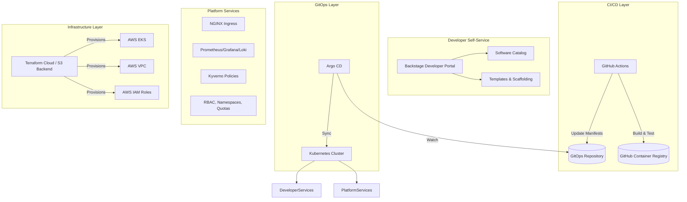

# Platform Architecture

This document describes the high-level architecture of the caps360 Internal Developer Platform (IDP).

## Layered Architecture

The platform is designed in clear, distinct layers, separating infrastructure provisioning from application delivery and platform capabilities.

## Infrastructure Layer

We use Terraform to define the AWS infrastructure. This includes the VPC, Subnets, and the Elastic Kubernetes Service (EKS) cluster. State is stored in an S3 bucket with DynamoDB locking.

## GitOps Layer

Argo CD is deployed via Helm immediately after the EKS cluster is provisioned. Argo CD uses the "App of Apps" pattern to bootstrap the cluster. A root `Application` (defined in `platform-services/bootstrap.yaml`) syncs all other platform components and applications into the cluster declaratively.

## Observability

The platform includes a robust observability stack out-of-the-box:
- **Metrics**: `kube-prometheus-stack` (Prometheus, Alertmanager, Grafana)
- **Logging**: `loki-stack` (Loki, Promtail)

Developers can add a `ServiceMonitor` resource to their applications (included in the golden-path Helm chart) to automatically scrape custom metrics.

## Security and Governance

We employ Kyverno as our admission controller to enforce policies across the cluster. Examples include enforcing non-root execution and requiring resource limits on all pods. Base RBAC roles are provided to grant developers read-only access to their specific namespaces without compromising cluster security.

## Developer Portal

Backstage is integrated to serve as the unified frontend for our developer platform. It acts as a service catalog and provides software templates so developers can quickly scaffold new microservices that conform to organizational standards.
